<div align="center">

# Quickshell

**A modern, feature-rich desktop shell for Wayland compositors.**

[Niri](https://github.com/YaLTeR/niri) · [Hyprland](https://github.com/hyprwm/Hyprland) · [MangoWC](https://github.com/DreamMaoMao/mango)

[](https://github.com/ekremx25/quickshell/actions/workflows/ci.yml)
[](LICENSE)
[]()
[](https://github.com/outfoxxed/quickshell)

https://github.com/user-attachments/assets/c32273fd-03a5-41d9-ab4e-100727b9591d

</div>

---

Built on top of [outfoxxed's Quickshell framework](https://github.com/outfoxxed/quickshell), this configuration turns it into a complete desktop shell: a top bar, dock, settings dashboard, on-screen display, notification centre, blue-light filter, Material You theming, and more — all drag-and-drop customisable and compositor-agnostic.

## Table of Contents

- [Features](#features)
- [Supported Compositors](#supported-compositors)
- [Dependencies](#dependencies)
- [Installation](#installation)
- [Configuration](#configuration)
- [Night Light](#night-light)
- [Audio Equaliser](#audio-equaliser)
- [Architecture](#architecture)
- [Troubleshooting](#troubleshooting)
- [Links](#links)
- [License](#license)

## Features

### Top Bar
- **Workspaces** — Roman / Japan / decimal numerals, scrollable, per-monitor visibility
- **System Info** — CPU, RAM, temperature, disk usage, groupable
- **Audio** — Volume control, mute, 10-band parametric equaliser
- **Weather** — Current conditions with optional desktop widget
- **Clock & Calendar** — With agenda and event countdown
- **Notification Centre** — Grouped history, DND, per-app filters, customisable popup position
- **System Tray** — Standard StatusNotifierItem protocol
- **Clipboard Manager** — History with copy-on-click

### Dock
- Animated zoom effect on hover
- Drag-and-drop pinning and reordering
- Live running indicators (dot or line, configurable)
- Per-monitor visibility
- Auto-hide with intelligent window-overlap detection
- Left/right module slots (Weather, Volume, Tray, Power, Media, Notepad, …)

### Settings Dashboard
- Drag-and-drop bar module arrangement
- Bar position toggle (top / bottom / left / right)
- Per-screen module assignment (OSD on one monitor, notifications on another)
- Seven built-in layout presets (macOS, Windows 11, GNOME, KDE, Unity, ZorinOS, Custom)
- Material You theme editor with live wallpaper colour extraction

### Fonts
- System-wide font picker for general and monospace families (writes to `kdeglobals` and `qt6ct.conf`)
- Live preview tiles with the current selection rendered in situ
- Searchable catalogue of every installed family, sourced via `fc-list` (includes user fonts in `~/.local/share/fonts`)
- Applies without a shell restart: the Theme singleton re-reads the system font and every bar / dock / popup / settings module updates on the fly
- Nerd Font glyphs stay pinned to `JetBrainsMono Nerd Font` so icons keep rendering after the switch

### Monitor Management
- Resolution, refresh rate, and scale per output
- HDR, VRR, 10-bit colour, wide-gamut colour management (sRGB / DCI-P3 / Adobe RGB / Rec.2020)
- Drag-to-arrange multi-monitor layout canvas
- SDR brightness, saturation, and reference luminance for HDR outputs
- Applied with a single `hyprctl --batch` call on Hyprland (no flicker)

### Night Light
- Blue-light filter with 1000–6500 K slider and five presets
- **Fixed-time schedule** with midnight-wrap support (e.g. 19:00 → 07:00)
- Cross-compositor backend: `hyprsunset` on Hyprland, `gammastep` on wlroots
- Persists through shell restart; auto-applies on startup

### Extras
- **OSD** for volume and brightness
- **App Drawer** launcher with fuzzy search
- **Wallpaper Picker** with Material You palette extraction ([matugen](https://github.com/InioX/matugen))
- **Lock Screen** — wallpaper, dim/lock/suspend timeouts, media inhibit
- **Mouse & Keyboard** — sensitivity, scroll factor, cursor theme
- **Network & Bluetooth** connection managers
- **VPN** connection manager (NetworkManager + WireGuard)
- **API Keys** — configure [SmartComplete](https://github.com/ekremx25/smartcomplete) AI providers (OpenAI, Claude, Groq, Ollama, …)
- **Notepad** and **Event Countdown**

## Screenshots

<table>
  <tr>
    <td align="center">
      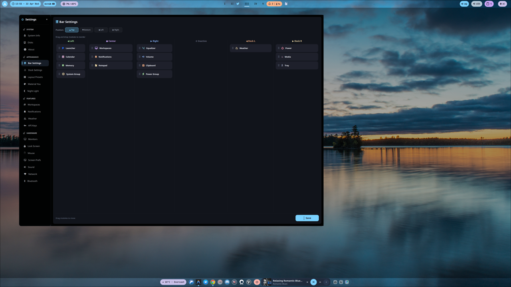
      <sub><b>Bar Settings</b> — drag-drop module layout, four positions, per-screen visibility</sub>
    </td>
    <td align="center">
      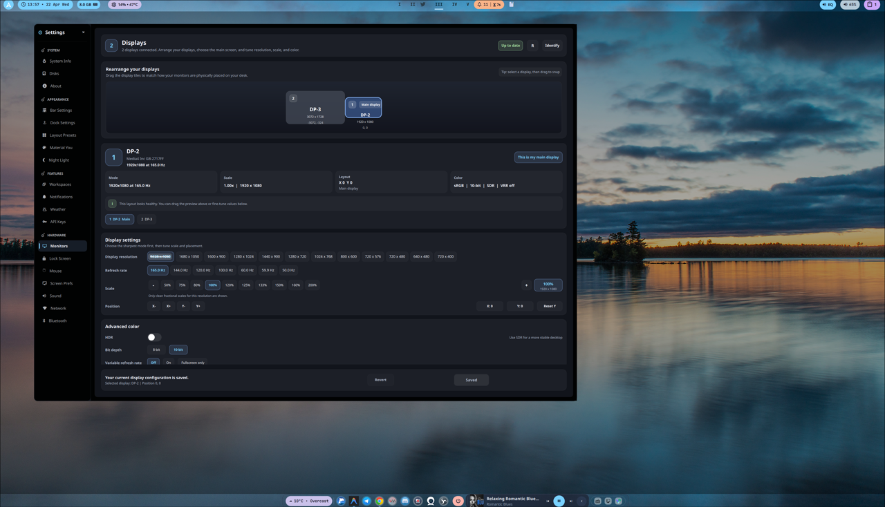
      <sub><b>Monitors</b> — resolution, scale, HDR, VRR, colour management, drag-to-arrange canvas</sub>
    </td>
  </tr>
  <tr>
    <td align="center">
      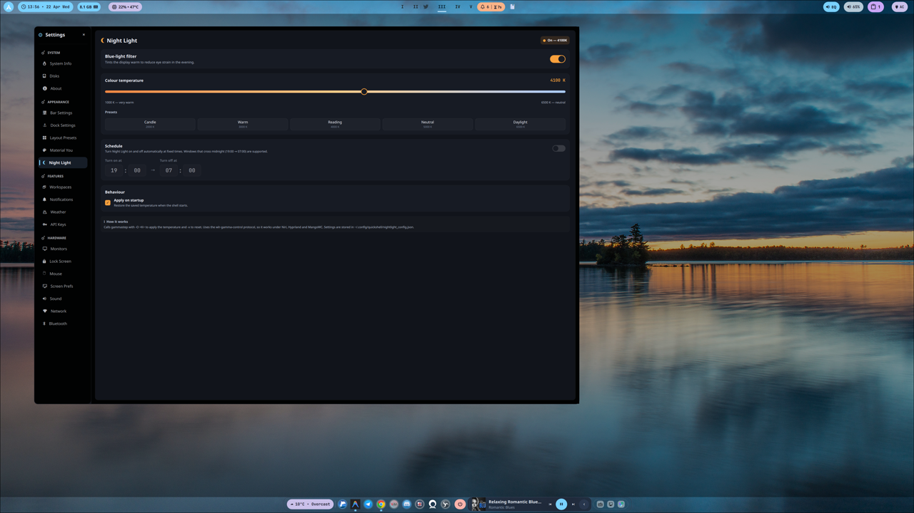
      <sub><b>Night Light</b> — temperature slider, presets, fixed-time schedule (hyprsunset / gammastep)</sub>
    </td>
    <td align="center">
      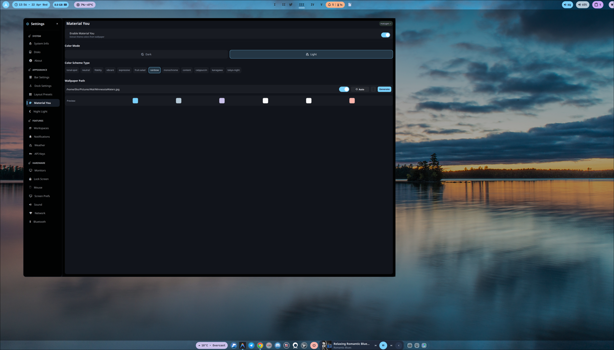
      <sub><b>Material You</b> — wallpaper-derived palette, light/dark, multiple scheme types</sub>
    </td>
  </tr>
  <tr>
    <td align="center">
      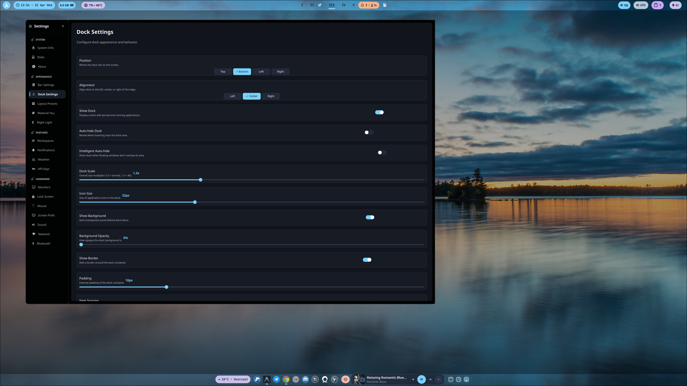
      <sub><b>Dock Settings</b> — auto-hide, indicator style, icon scale, alignment</sub>
    </td>
    <td align="center">
      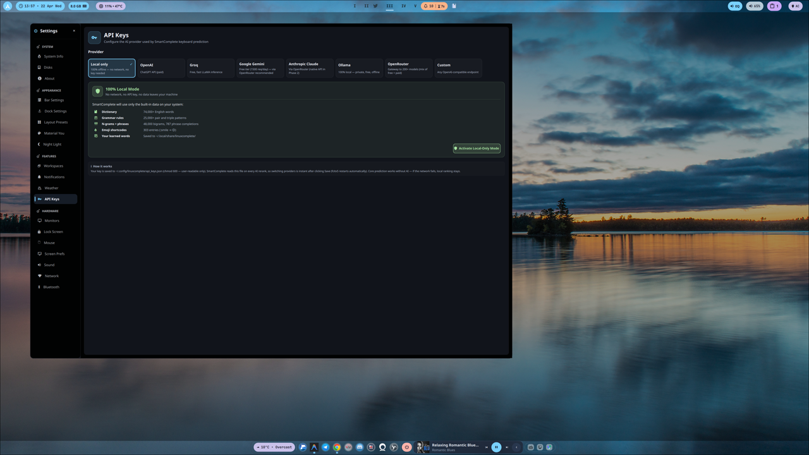
      <sub><b>API Keys</b> — local-only or any of 7 cloud providers for SmartComplete</sub>
    </td>
  </tr>
  <tr>
    <td align="center">
      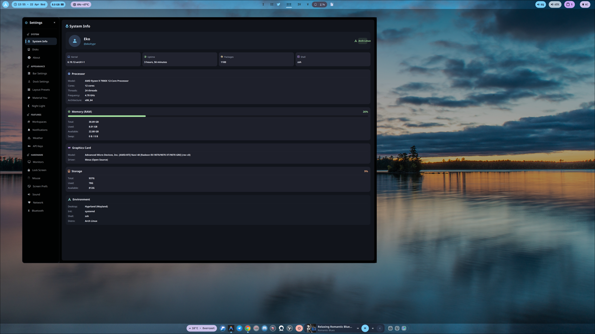
      <sub><b>System Info</b> — CPU, RAM, GPU, storage, environment</sub>
    </td>
    <td align="center">
      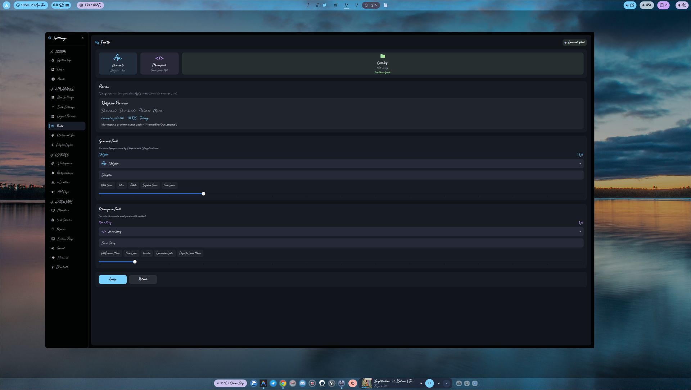
      <sub><b>Fonts</b> — system-wide Qt/KDE font picker with live preview, searchable <code>fc-list</code> catalogue</sub>
    </td>
  </tr>
</table>

### Bar popovers

Click any of these on the bar to reveal an inline popover.

<table>
  <tr>
    <td align="center">
      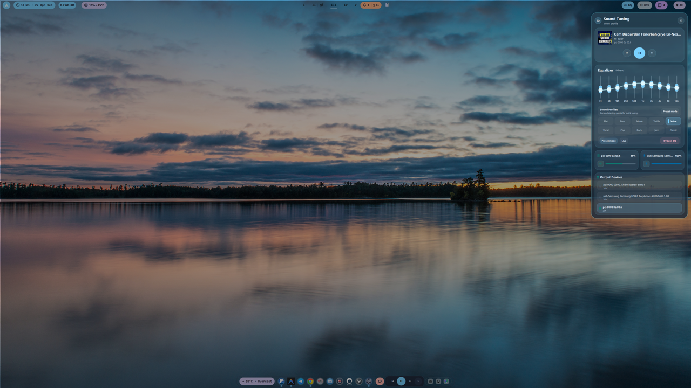
      <sub><b>Equalizer</b> — 10-band parametric EQ with sound theming</sub>
    </td>
    <td align="center">
      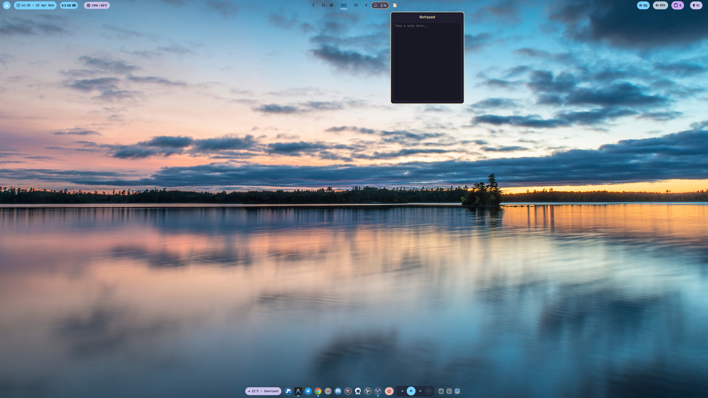
      <sub><b>Notepad</b> — quick scratchpad, autosaved</sub>
    </td>
    <td align="center">
      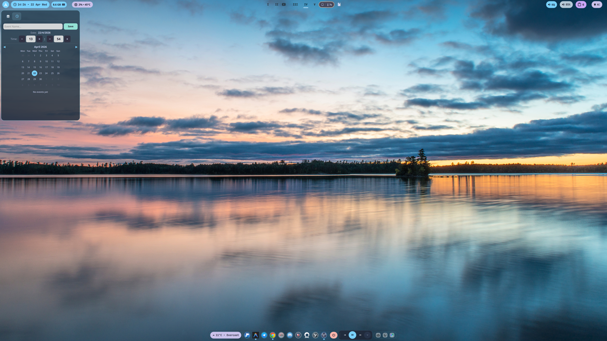
      <sub><b>Calendar</b> — month view with today highlighted</sub>
    </td>
  </tr>
</table>

<details>
<summary><b>More Settings pages</b> (click to expand)</summary>

<table>
  <tr>
    <td align="center">
      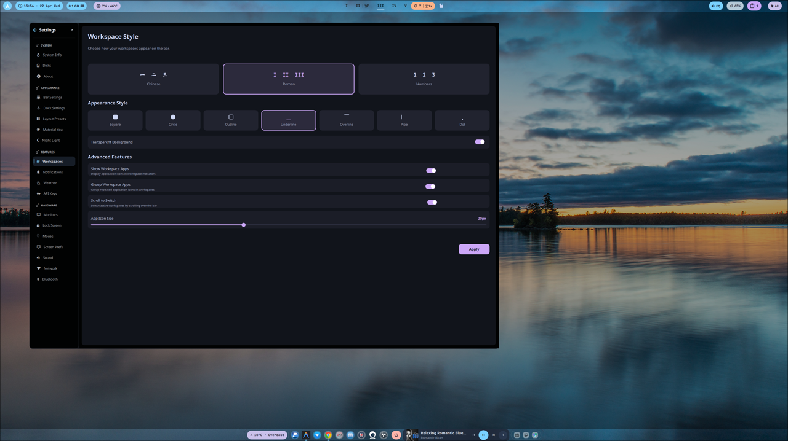
      <sub><b>Workspaces</b> — numeral style (Roman / Japan / Decimal), grouping, scroll behaviour</sub>
    </td>
    <td align="center">
      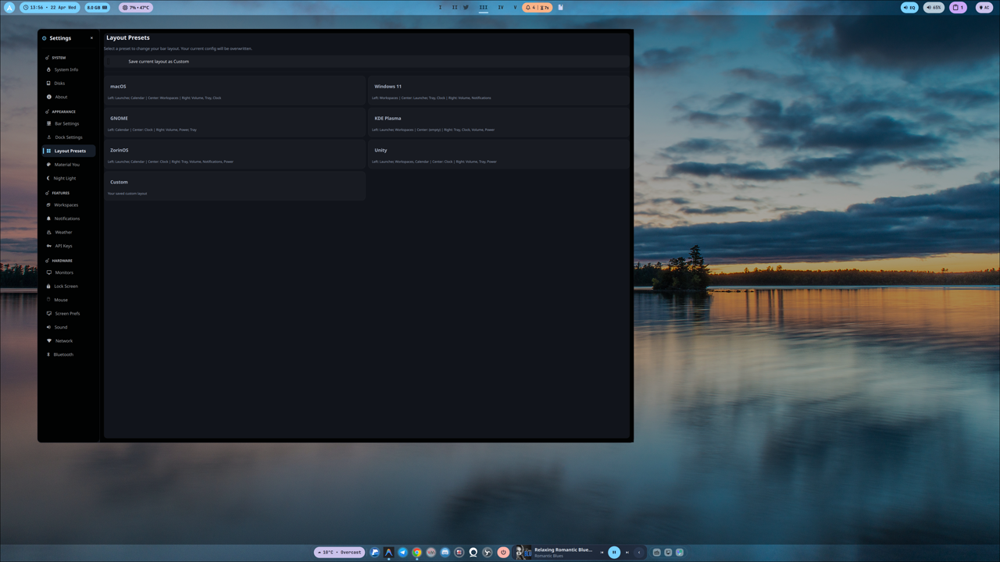
      <sub><b>Layout Presets</b> — macOS, Windows 11, GNOME, KDE, Unity, ZorinOS, Custom</sub>
    </td>
  </tr>
  <tr>
    <td align="center">
      
      <sub><b>Notifications</b> — DND, popup position, animation speed, filters</sub>
    </td>
    <td align="center">
      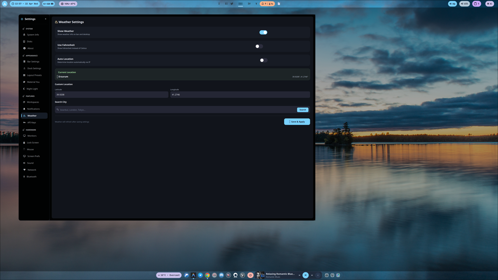
      <sub><b>Weather</b> — location and provider configuration</sub>
    </td>
  </tr>
  <tr>
    <td align="center">
      
      <sub><b>Lock Screen</b> — wallpaper, dim/lock/suspend timeouts, media inhibit</sub>
    </td>
    <td align="center">
      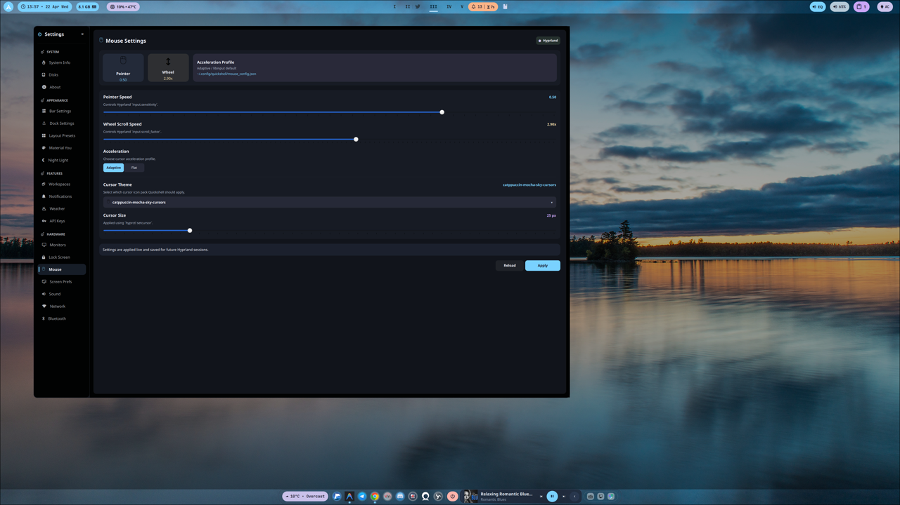
      <sub><b>Mouse</b> — sensitivity, scroll factor, accel profile, cursor theme</sub>
    </td>
  </tr>
  <tr>
    <td align="center">
      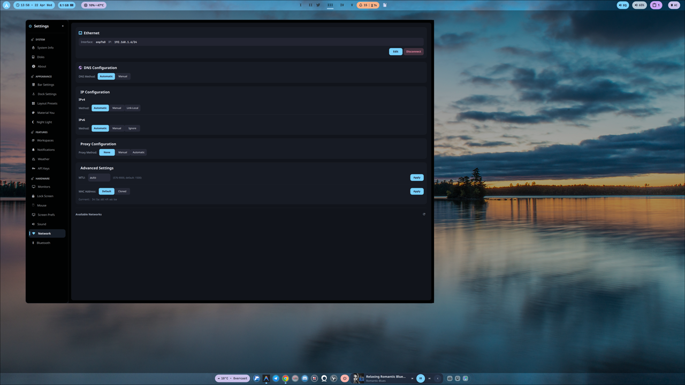
      <sub><b>Network</b> — Ethernet, Wi-Fi, DNS, proxy, advanced</sub>
    </td>
    <td align="center">
      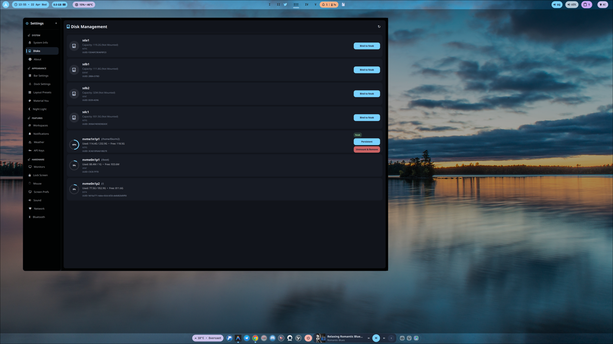
      <sub><b>Disks</b> — mount points, removable drives, fstab helper</sub>
    </td>
  </tr>
  <tr>
    <td align="center" colspan="2">
      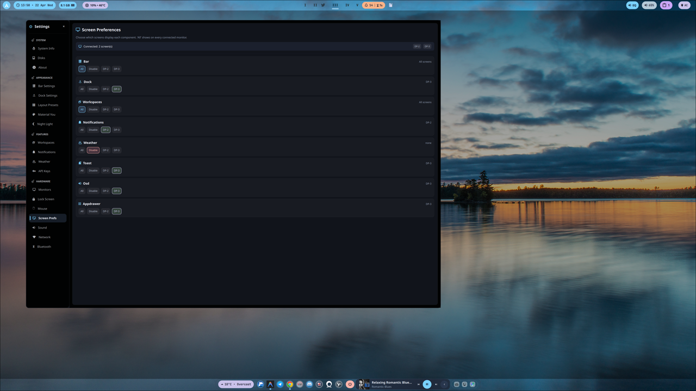
      <br>
      <sub><b>Screen Prefs</b> — assign each component (bar, dock, OSD, notif) to specific monitors</sub>
    </td>
  </tr>
</table>

</details>

## Supported Compositors

| Compositor | Status | Notes |
|------------|:------:|-------|
| [Niri](https://github.com/YaLTeR/niri) | Full | Event-driven IPC, auto-reconnect |
| [Hyprland](https://github.com/hyprwm/Hyprland) | Full | Socket2 event stream; Night Light requires `hyprsunset` |
| [MangoWC](https://github.com/DreamMaoMao/mango) | Full | Tag-based workspace model |

## Dependencies

### Core

| Package | Purpose |
|---------|---------|
| `quickshell` | Shell framework ([outfoxxed/quickshell](https://github.com/outfoxxed/quickshell)) |
| `niri`, `hyprland`, or `mango` | A Wayland compositor |
| `networkmanager` | Network management (`nmcli`) |
| `bluez` + `bluez-utils` | Bluetooth |
| `pipewire` + `pipewire-pulse` + `wireplumber` + `libpulse` | Audio control and EQ filter-chain |
| `jq` | JSON processing in helper scripts |

### Fonts

| Font | Package (Arch) |
|------|----------------|
| JetBrainsMono Nerd Font | `ttf-jetbrains-mono-nerd` |
| Inter | `ttf-inter` |
| Font Awesome 6 Free | `ttf-font-awesome` |

### Theming

- **[matugen](https://github.com/InioX/matugen)** — Material You palette from wallpapers
  - Arch AUR: `paru -S matugen-bin` (or `yay -S matugen-bin`)
  - Cargo: `cargo install matugen`

### Optional (feature-specific)

| Package | Feature |
|---------|---------|
| `hyprsunset` | Night Light on Hyprland (required) |
| `gammastep` | Night Light on Niri / MangoWC (required) |
| `kconfig` | Fonts picker (`kreadconfig6` / `kwriteconfig6` write to `kdeglobals`) |
| `qt6ct-kde` (AUR) | Fonts picker also writes to `qt6ct.conf` when `QT_QPA_PLATFORMTHEME=qt6ct` |
| `fontconfig` | Fonts picker catalogue via `fc-list` (pre-installed on most distros) |
| `inotify-tools` | Event-driven config file watching (otherwise falls back to polling) |
| `grim` + `slurp` | Screenshot helpers |
| `socat` or `ncat` | Hyprland event stream (used by the dock's live running indicators) |

### One-liner install (Arch)

```bash
sudo pacman -S quickshell networkmanager bluez bluez-utils pipewire \
  pipewire-pulse wireplumber libpulse jq inotify-tools \
  kconfig fontconfig \
  ttf-jetbrains-mono-nerd ttf-inter ttf-font-awesome

# qt6ct (AUR fork with KDE integration)
yay -S qt6ct-kde
```

## Installation

1. **Clone the repository**

   ```bash
   git clone https://github.com/ekremx25/quickshell ~/.config/quickshell
   ```

2. **Install dependencies** (see the section above).

3. **Spawn quickshell at compositor startup**

   <details>
   <summary><b>Niri</b> — <code>~/.config/niri/config.kdl</code></summary>

   ```kdl
   spawn-at-startup "quickshell"
   ```
   </details>

   <details>
   <summary><b>Hyprland</b> — <code>~/.config/hypr/hyprland.conf</code></summary>

   ```ini
   exec-once = quickshell
   ```
   </details>

   <details>
   <summary><b>MangoWC</b> — <code>~/.config/mango/autostart.sh</code></summary>

   ```bash
   pgrep -x quickshell >/dev/null || quickshell &
   ```
   </details>

   Or launch manually: `quickshell`.

## Configuration

All settings live in `~/.config/quickshell/` and are edited through the in-app **Settings** dashboard (launcher logo on the bar → settings icon).

| File | Contents |
|------|----------|
| `bar_config.json` | Bar modules, layout, position |
| `dock_config.json` | Pinned apps, scale, alignment |
| `monitor_config.json` | Resolution, scale, HDR, VRR, colour mode per output |
| `theme_config.json` | Material You settings, wallpaper path |
| `lock_config.json` | Lock screen wallpaper and timeouts |
| `notification_config.json` | DND, popup position, animation speed, filters |
| `mouse_config.json` | Sensitivity, scroll factor, cursor theme |
| `screen_config.json` | Per-component monitor filtering |
| `nightlight_config.json` | Blue-light filter state + schedule |

All writes are **atomic** (temp file + rename). A shell crash mid-save never leaves a corrupt config.

## Night Light

Warm-tint the display in the evening to reduce eye strain. Manual control, fixed-time scheduling, cross-compositor.

### Setup

Install the backend for your compositor:

```bash
# Hyprland
sudo pacman -S hyprsunset

# Niri / MangoWC
sudo pacman -S gammastep
```

> **Why two backends?** Modern Hyprland removed the `wlr-gamma-control` protocol that gammastep relies on, so it now ships its own daemon (`hyprsunset`). Quickshell detects the active compositor and uses the appropriate backend automatically.

### Usage

**Settings → Appearance → Night Light**:

- Toggle the filter on or off
- Adjust temperature with the 1000–6500 K slider
- Pick a preset (Candle, Warm, Reading, Neutral, Daylight)
- Enable the **Schedule** card and set on/off times — e.g. `19:00 → 07:00` (midnight-wrap supported)
- Enable **Apply on startup** to restore the saved temperature at shell boot

## Audio Equaliser

Native 10-band parametric EQ built on a PipeWire filter-chain. The UI writes `eq/parametric-eq.txt` and a helper script creates:

- `effect_input.eq` — virtual EQ sink (applications play into this)
- `effect_output.eq` — processed stream, manually linked to the selected physical sink

### Quick start

```bash
# Apply a flat curve to the current default sink
~/.config/quickshell/scripts/eq_filter_chain.sh apply 0 0 0 0 0 0 0 0 0 0 auto

# Check status
~/.config/quickshell/scripts/eq_filter_chain.sh status

# Disable
~/.config/quickshell/scripts/eq_filter_chain.sh disable
```

Expected healthy output: `conf_exists=yes`, plus `effect_input.eq` and `filter-chain` visible in `wpctl status`.

### Device switching

When you change output devices in `pavucontrol` or another mixer, the Equalizer module refreshes sink state in the background and **auto-reapplies** the active EQ curve — the same preset follows you from speakers → USB headphones → Bluetooth without rebuilding the curve.

The last known physical sink is stored in `~/.local/state/quickshell/eq_filter_chain.state` as `BASE_SINK`.

## Architecture

A short tour for contributors. Full source is under [`Services/`](Services/), [`Modules/`](Modules/), and [`Widgets/`](Widgets/).

### Staged loading — [`shell.qml`](shell.qml)

The shell boots in three phases to speed up the first visible frame:

| Phase | Delay | Loads |
|:-----:|:-----:|-------|
| 1 | 0 ms | `ShellBootstrap` + `Bar` |
| 2 | 300 ms | `EqBootstrap`, `MouseBootstrap` |
| 3 | 600 ms | `Dock`, `WeatherDesktop`, `ToastHost`, `VolumeOSD` |

### Core persistence — [`Services/core/`](Services/core/)

| File | Role |
|------|------|
| `JsonDataStore.qml` | Schema versioning with `migrate()` and `validate()` hooks, default fallback |
| `TextDataStore.qml` | Atomic write (temp + rename) + write queue (no data loss on rapid saves) |
| `FileChangeWatcher.qml` | `inotifywait` with automatic polling fallback when `inotify-tools` is missing |
| `atomic_write.sh` | Argv-based write helper — zero shell interpretation, no injection risk |

### Compositor abstraction — [`Services/CompositorService.qml`](Services/CompositorService.qml)

A singleton that detects the active compositor from environment variables and exposes a uniform API (`monitors`, `focusWindow`, `powerOnMonitors`, …) so modules never need to special-case Hyprland vs. Niri vs. Mango.

### Staged, defensive modules

Every long-running integration (notification server, volume subscription, Niri event stream, Hyprland socket, Mango tag events, PipeWire EQ) ships with retry logic and auto-reconnect after compositor restarts or IPC drops.

## Troubleshooting

<details>
<summary><b>Icons are missing or show as empty squares</b></summary>

Install JetBrainsMono Nerd Font and refresh the font cache:

```bash
sudo pacman -S ttf-jetbrains-mono-nerd
fc-cache -fv
```
</details>

<details>
<summary><b>Network or Bluetooth toggles do nothing</b></summary>

Make sure the services are running:

```bash
systemctl enable --now NetworkManager
systemctl enable --now bluetooth
```
</details>

<details>
<summary><b>Night Light does not tint the screen</b></summary>

- **Hyprland**: confirm `hyprsunset` is installed (`which hyprsunset`). Modern Hyprland no longer exposes `wlr-gamma-control`, so `gammastep` will report _"Zero outputs support gamma adjustment"_ and silently do nothing.
- **Niri / MangoWC**: test `gammastep -O 4000` directly — it should tint the screen. If it doesn't, the wlroots gamma-control protocol may not be advertised by your compositor build.
- Look for an error banner at the top of **Settings → Night Light** for diagnostic info.
</details>

<details>
<summary><b>The equaliser has no effect</b></summary>

Apply a flat curve and inspect PipeWire:

```bash
~/.config/quickshell/scripts/eq_filter_chain.sh apply 0 0 0 0 0 0 0 0 0 0 auto
~/.config/quickshell/scripts/eq_filter_chain.sh status
wpctl status | grep -E "effect_input.eq|filter-chain"
```

You should see `conf_exists=yes`, plus both `effect_input.eq` and `filter-chain` in `wpctl status`. If they're missing, confirm the PipeWire / WirePlumber / libpulse packages from the Core dependency list are installed.
</details>

<details>
<summary><b>Dock shows no running indicators on Hyprland</b></summary>

The dock uses Hyprland's socket2 stream via `socat` or `ncat`. Install one of them:

```bash
sudo pacman -S socat
# or
sudo pacman -S openbsd-netcat
```

Without either, the dock falls back to 2.5 s polling — indicators still work but update slower.
</details>

## Links

- Demos & tutorials: [YouTube: @Kernel-Windows](https://www.youtube.com/@Kernel-Windows)
- Built on: [outfoxxed/quickshell](https://github.com/outfoxxed/quickshell)
- Theming: [InioX/matugen](https://github.com/InioX/matugen)
- Companion project: [ekremx25/smartcomplete](https://github.com/ekremx25/smartcomplete)

## License

[MIT](LICENSE)
